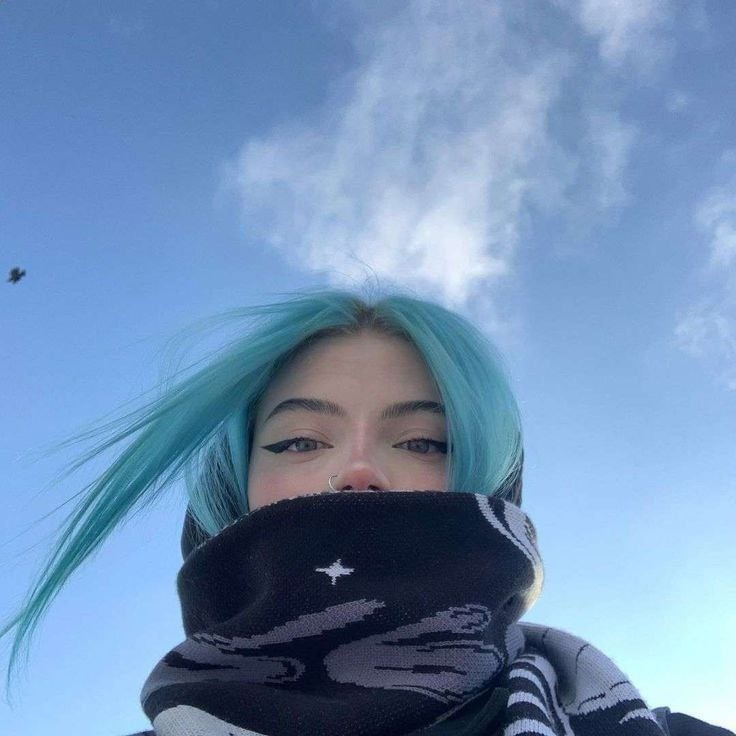

<!DOCTYPE html>
<html>

<head>

  

	<link rel="stylesheet" href="styles.css">
	
  
		<h1 align="center">
		Click to URL ⬇️
		</h1>
	

      

	

	

	

		<h1 align="center">🔥 Hi, I'm ostrovsky-swedesdart-rus!</h1>
		<h3 align="center">I am an advanced coder who writes C++, C#, C, JavaScript, TypeScript, Ruby, Dart, Flutter, HTML, CSS, B, Golang. Glad you visit my Github card</i> 
    

<h1 align="center">💡 Projects in NmpJS:</h1>
 • <a align="center" target="_blank" href="https://npmjs.com/package/pinguage">🎩 Pinguage</a><text> — Ping framework in Nodejs.</text> 
 • <a align="center" target="_blank" href="https://npmjs.com/package/vksnake">🏗️ VkSnake</a><text> — VK builded in Nodejs.</text> 
 • <a align="center" target="_blank" href="https://npmjs.com/package/vkstatic">🛒 VkStatic</a><text> — UP VK builded number two.</text> 
 • Outdated - <a align="center" target="_blank" href="https://npmjs.com/package/pinguage-request">💡 Pinguage-Request</a><text> — Get a result about the validity of the site in node js or type script.</text> 
 • <a align="center"><b>🔥 Further</b></a><text> – more</text>
<h1 align="center">ℹ️ Statistics to language (WHITE):</h1>

<h1 align="center"> 🛒 Statistics to language (BLACK):</h1>
 
<h1 align="center"><b>🎩 Github Stats:</b></h1>
	

   

<b>🚀 Github Contribution Graph</b>

  

</html>
